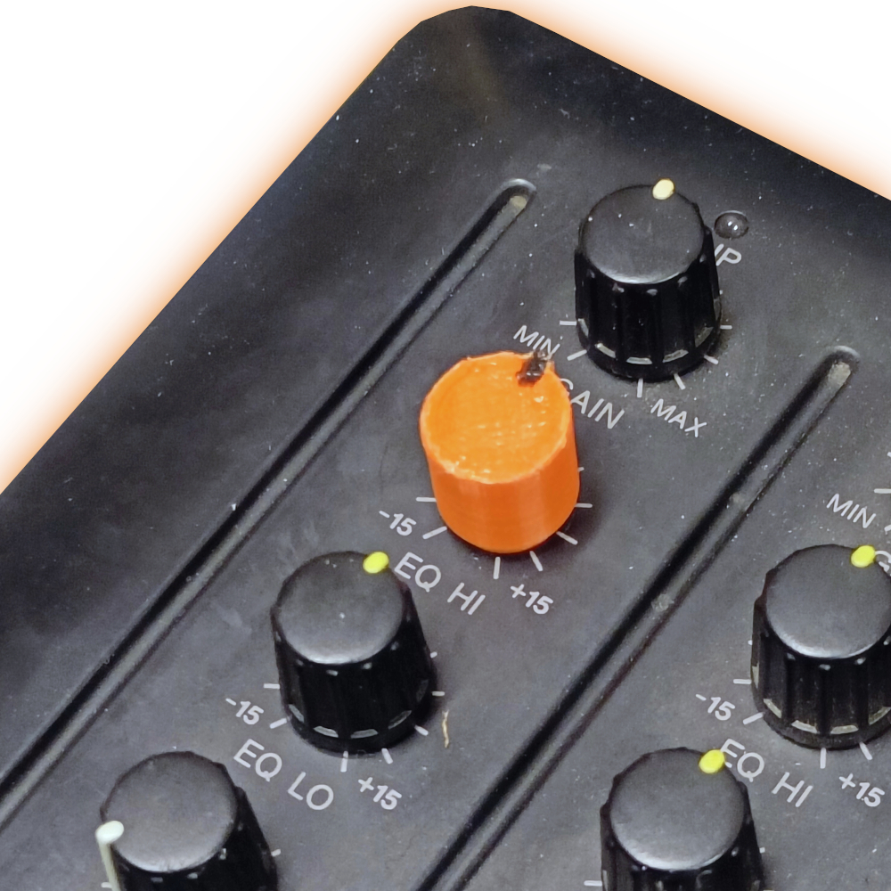

# Yamaha AM802 Potentiometer Knob

The following repo provides F3D, STL and 3MF files for a 3D-printable replacement potentiometer knob for the Yamaha AM802 mixer.

We created this model after acquiring a AM802 where a pot knob was missing.

The knob ain't the prettiest, but it's easily printable and certainly does the job :)

You can also find the files on thingiverse [here](https://www.thingiverse.com/thing:5406255)
